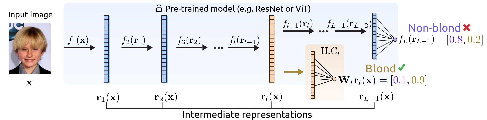

# Intermediate Layer Classifiers for OOD generalization

This repository contains code to reproduce the experiments from the paper <a href="https://arxiv.org/abs/2504.05461" target="_blank">"Intermediate Layer Classifiers for OOD generalization"</a>.

[](https://arxiv.org/abs/2504.05461)


## Overview


 
We explore how using representations from earlier layers of neural networks, rather than just the last layer, can improve OOD generalization. Main findings:

- Earlier layer representations often outperform last layer features for zero-shot OOD transfer
- Even with no OOD supervision, earlier layers can generalize better than the last layer
- Earlier features tend to be less affected by distribution shifts, suggesting a reason for their better generalization 

This repository contains code to reproduce the main experiments from the paper, including zero-shot and few-shot generalization, as well as layer sensitivity analysis.

## Installation

To get started, clone the repository and install the dependencies (tested with `Python 3.10`):
```
git clone git@github.com:oshapio/intermediate-layer-generalization.git
pip install -r requirements.txt
pip install -e .
```

## Using intermediate probes in your code

To utilize intermediate probes in your own experiments, you can use the `IntermediateProbeModel` class from `intermediate_gen/intermediate_probe_model.py`. This class is a wrapper around a PyTorch model that allows you to add probes to intermediate layers. Assuming you have a model `model` and the input size is fixed (e.g., `3x32x32` for CIFAR-10), with the `.forward()` method calling the module's forward pass in the order they are defined in the `__init__` method[^1], all you have to do is 

1. Define which layers you want to probe, e.g.:
  ```python
  layers_to_probe = range(1, len(model.children()) - 1) # all layers except the first and last
  ```
2. Get the number of features in each layer given a fixed input size:
  ```python
  def get_repr_dim_at_layer(model, layer_idx, init_input):
    model.eval()
    
    for idx, layer in enumerate(model.children()):
        init_input = layer(init_input)
        if idx == layer_idx:
            return init_input.numel()
  INPUT_DIM = (1, 3, 32, 32) # e.g. for CIFAR-10
  num_features_per_layer = {layer_idx: get_repr_dim_at_layer(model, layer_idx, torch.randn(INPUT_DIM)) for layer_idx in layers_to_probe}
  ```
3. Initialize the model with the probes:
  ```python
  from intermediate_gen import LinearProbeModel

  NUM_CLASSES = 10 # e.g. for CIFAR-10
  lin_probes = {layer_idx: LinearProbeModel(num_features_per_layer[layer_idx], num_classes=NUM_CLASSES) for layer_idx in layers_to_probe}
  ```
4. Use it in the training loop. This only requires to change the call to the model to include the probes: instead of executing `z := model(x); loss_step(z, y)`, you would do:
```python
for layer_idx, layer in enumerate(model.children()):
    x = layer(x)
    if layer_idx in lin_probes:
        x_detached_flat = x.detach().view(x.size(0), -1) # flatten the features

        # get the prediction
        lin_probe = lin_probes[layer_idx]
        lin_probe.step_loss(x_detached_flat, y)
```


[^1]: meaning that you can simulate the forward pass by calling `x:=input; for module in self.children(): x = module(x)`, and it holds that `x ≡ model(input)`; the notebooks below detail this in full.
## Reproducing Experiments


We provide notebooks to reproduce the main experiments using a `ResNet18` model showing the utility of intermediate layers for OOD generalization. The notebooks contain detailed instructions on how to run the experiments and visualize the results. These notebooks do not concern themselves with tuning the hyperparameters and use default sensible values, ensuring a quick and easy way to reproduce the results. The results are nearly identical to those in the paper.

### CIFAR-10 & CIFAR-10C

Running both zero-shot and few-shot variants:
- [Zero-shot version](examples/CIFAR/zero-shot.ipynb) [](https://colab.research.google.com/drive/1FUQ3ruGKApqfLspkJ-4VKpNnjt0Trxws): This notebook shows that earlier layers generalize better than the last layer when no OOD examples are available for their training. They are trained on the in-distribution data only. A small number of OOD examples are used for model selection, but the model is not trained on them.

  The notebook illustrates a simplified version of the experiment in the paper, with fixed hyperparameters, focusing on probe selection across training epochs and shifts.

- [Few-shot version](examples/CIFAR/few-shot.ipynb) [](https://colab.research.google.com/drive/1JGKik-7Iww942YO5maLzpLJ88vO6zwk2): This notebook shows that even when few OOD examples are available, earlier layers can generalize better than the last layer.

  This version slightly differs from the paper, as we don't tune the probes per distribution shift but rather use the same probe for all shifts while using 1,000 points for tuning in total (across 20 distribution shifts). This cuts compute time significantly (to roughly 30 minutes) while still showing the same trend.

### Waterbirds & CelebA

- Running zero-shot experiments: [Waterbirds & CelebA zero-shot](examples/CelebA-Waterbirds/zero-shot.ipynb) [](https://colab.research.google.com/drive/13HfklZatq9Bq082ZZZe-mUAj4oAH04lh), with conclusions anologous to the CIFAR-10 experiments.

### Analysis (CIFAR-10C)

- For analysis, we provide layer feature sensitivity analysis notebooks for the CIFAR-10C dataset: [CIFAR-10C layer sensitivity](examples/CIFAR/layer-sensitivity.ipynb) [](https://colab.research.google.com/drive/1-8AE1HzM3-nt__hkHJ6uWFFFlc33zZom). This notebook shows that earlier layers are less affected by distribution shifts, suggesting a reason for their better generalization.

## Citation

If you find our work useful, please cite:

```bibtex
@inproceedings{uselis2024intermediate,
  title={Intermediate Layer Classifiers for OOD generalization},
  author={Uselis, Arnas and Oh, Seong Joon},
  booktitle={The Thirteenth International Conference on Learning Representations},
  year={2024}

```

## Acknowledgements

This repository relies on model checkpoints from the following sources:
- WaterBirds and CelebA datasets: [Last Layer Re-Training is Sufficient for Robustness to Spurious Correlations](https://github.com/PolinaKirichenko/deep_feature_reweighting#data-access)
- CIFAR-10: [PyTorch models trained on CIFAR-10 dataset](https://github.com/huyvnphan/PyTorch_CIFAR10)
- MultiCelebA: [Improving Robustness to Multiple Spurious Correlations by Multi-Objective Optimization](https://github.com/Nayeong-V-Kim/Improving_robustness_to_multiple_spurious_correlations_by_multi-objective_optimization) (to be released soon)
- CIFAR-100: [Do Deep Neural Network Solutions form a Star Domain?](https://github.com/aktsonthalia/starlight) 
